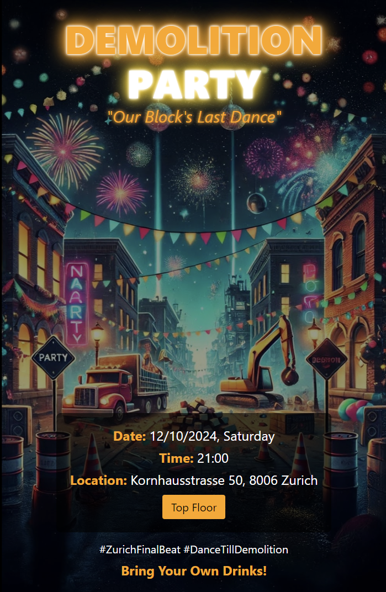

# Party Poster Generator

## Overview

The Party Poster Generator is an interactive React application that allows users to create customizable posters for a "demolition party" event. Users can switch between different color themes and animation styles, and download the final poster as a PNG image suitable for Instagram stories.



## Features

- Interactive poster customization
- Multiple color themes
- Various animation effects for the title
- Download functionality to save the poster as a PNG image
- Responsive design

## Prerequisites

Before you begin, ensure you have the following installed:
- Node.js (v14.0.0 or later)
- npm (v6.0.0 or later)

## Installation

1. Clone the repository:
   ```
   git clone https://github.com/your-username/demolition-party-poster.git
   cd demolition-party-poster
   ```

2. Install the dependencies:
   ```
   npm install
   ```

## Local Development

To run the project locally:

1. Start the development server:
   ```
   npm start
   ```

2. Open your browser and visit `http://localhost:3000`

## Building for Production

To create a production build:

```
npm run build
```

This will create a `build` directory with optimized production-ready files.

## Deployment

### Deploying to Netlify

1. Create a Netlify account if you don't have one: https://app.netlify.com/signup

2. Install the Netlify CLI:
   ```
   npm install netlify-cli -g
   ```

3. Login to your Netlify account:
   ```
   netlify login
   ```

4. Build your project:
   ```
   npm run build
   ```

5. Deploy to Netlify:
   ```
   netlify deploy
   ```

6. Follow the prompts in the CLI:
   - Select "Create & configure a new site"
   - Choose your team
   - Set a custom site name or let Netlify generate one for you

7. When asked for the publish directory, enter: `build`

8. Preview your deployment and if everything looks good, deploy to production:
   ```
   netlify deploy --prod
   ```

Your site is now live! Netlify will provide you with a URL where you can access your deployed application.

## Customization

- To change the background image, replace the file at `public/block-party-background.png` with your own image.
- To modify color themes or animations, edit the `colorThemes` and `animations` arrays in `src/App.js`.

## Contributing

Contributions are welcome! Please feel free to submit a Pull Request.

## License

This project is open source and available under the [MIT License](LICENSE).
